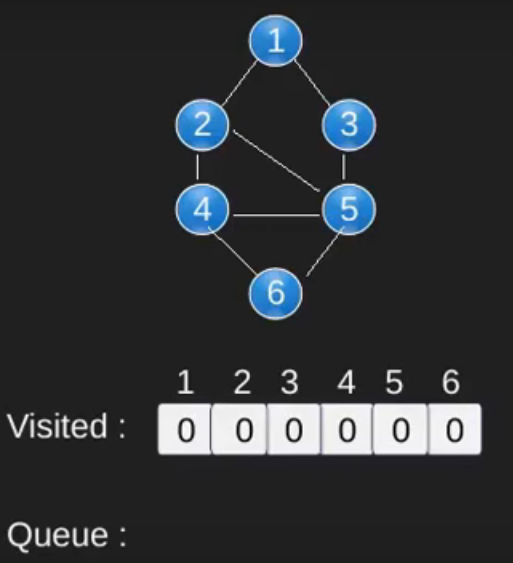
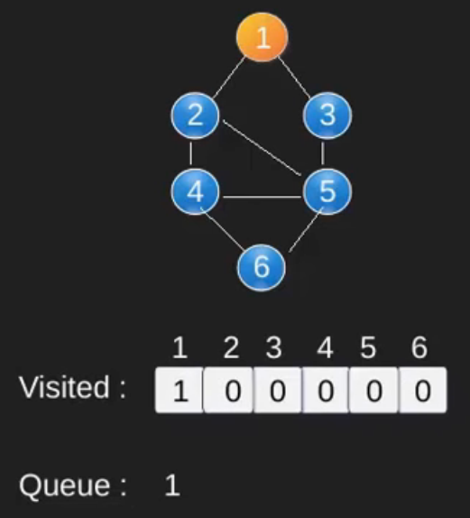
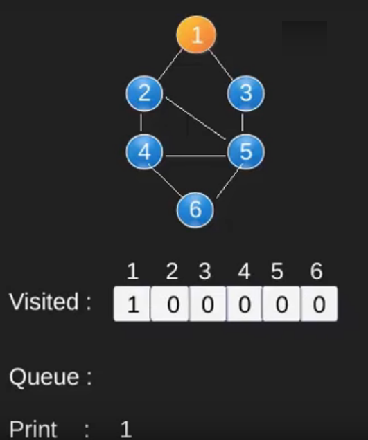
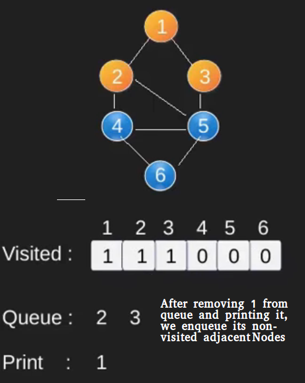
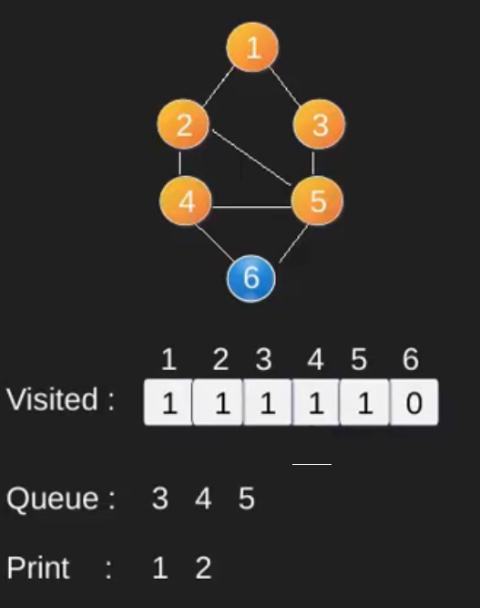
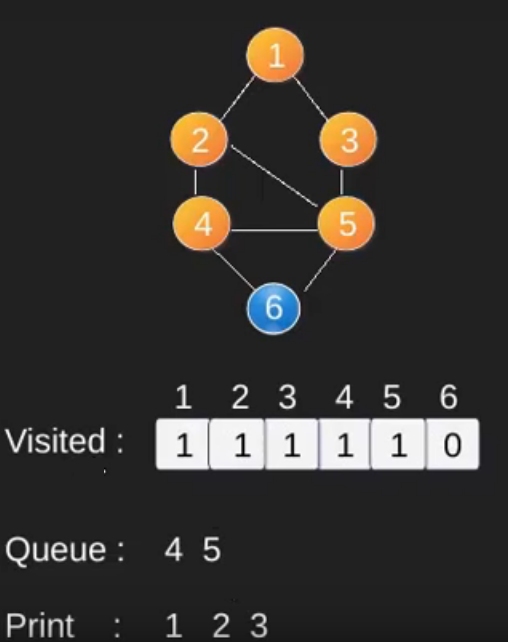
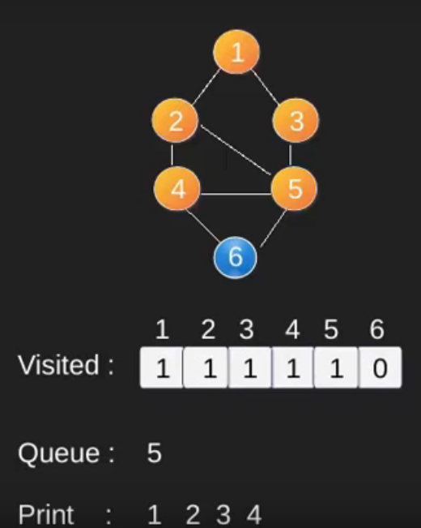
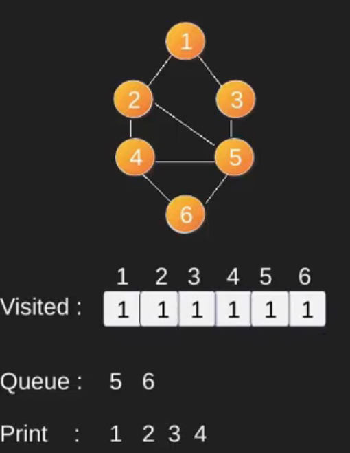
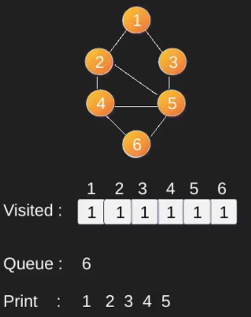
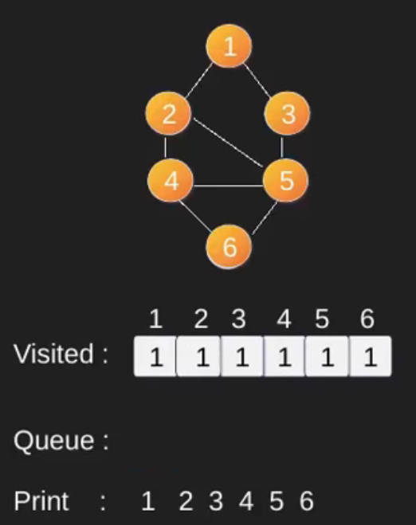

# Обход дерева в ширину

https://www.geeksforgeeks.org/breadth-first-search-or-bfs-for-a-graph/

Для простоты предполагается, что все вершины достижимы из начальной вершины.

**Сложность времени:** `O(V + E)`, где V - количество вершин в графе, а E - количество ребер в графе.
